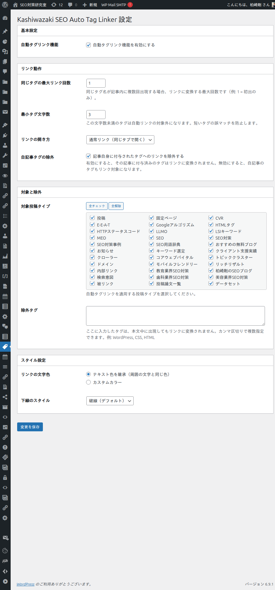
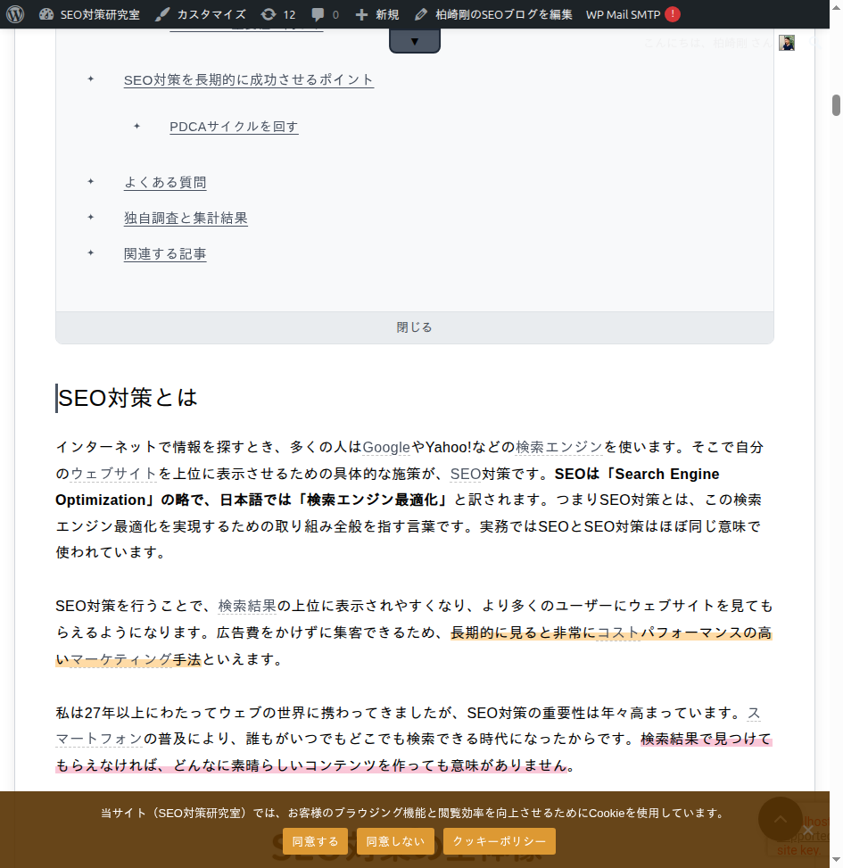

# Kashiwazaki SEO Auto Tag Linker


投稿コンテンツ内のタグ名に一致するテキストを自動的にタグアーカイブページへのリンクに変換し、内部リンク構造を強化するWordPress用SEOプラグインです。

## 機能

- **自動タグリンク変換** - 投稿コンテンツ内のタグ名を検出し、タグアーカイブページへのリンクに自動変換
- **同一タグリンク回数制御** - 同じタグが複数回出現する場合のリンク変換回数を制限（例: 初出のみ）
- **最小タグ文字数フィルタ** - 短いタグ名の誤マッチを防止するための文字数下限設定
- **除外タグリスト** - 自動リンク対象外にするタグをカンマ区切りで指定可能
- **自記事タグ除外** - 記事自身に付与されたタグへのリンクを除外するオプション
- **カスタム投稿タイプ対応** - 投稿以外のカスタム投稿タイプにも適用可能
- **リンクターゲット設定** - 同じタブまたは新しいタブで開くかを選択可能
- **リンクスタイル設定** - リンク文字色（継承/カスタム）と下線スタイル（破線・実線・点線・二重線・波線・なし）を選択可能
- **安全なHTML処理** - 以下のHTML要素内のテキストは自動リンクの対象外
  - リンク: `<a>`
  - 見出し: `<h1>`〜`<h6>`
  - スクリプト・スタイル: `<script>`, `<style>`
  - コード: `<code>`, `<pre>`
  - フォーム: `<textarea>`, `<select>`, `<button>`
  - 埋め込み: `<svg>`, `<iframe>`, `<canvas>`, `<video>`, `<audio>`, `<object>`
  - その他: `<noscript>`, `<template>`

## スクリーンショット

### 設定画面


### 自動リンク動作例


## インストール

1. このリポジトリをダウンロードまたは `git clone` する
2. `wp-plugin-kashiwazaki-seo-auto-tag-linker` フォルダを `/wp-content/plugins/` に配置
3. WordPress管理画面の「プラグイン」から有効化

```bash
cd /path/to/wordpress/wp-content/plugins/
git clone https://github.com/TsuyoshiKashiwazaki/wp-plugin-kashiwazaki-seo-auto-tag-linker.git
```

## 使い方

1. プラグインを有効化すると、管理画面の左メニューに「Kashiwazaki SEO Auto Tag Linker」が表示されます
2. 設定画面で各オプションを調整してください:
   - **自動タグリンク機能**: 機能の有効/無効を切り替え
   - **同じタグの最大リンク回数**: 1記事内で同じタグをリンクに変換する最大回数
   - **最小タグ文字数**: 指定文字数未満のタグを対象外にする
   - **リンクの開き方**: 同じタブ / 新しいタブを選択
   - **自記事タグの除外**: 記事自身に付与されたタグへのリンクを除外
   - **除外タグ**: 自動リンクしたくないタグをカンマ区切りで指定
   - **対象投稿タイプ**: 自動リンクを適用する投稿タイプを選択
   - **リンクの文字色**: テキスト色を継承 / カスタムカラーから選択
   - **下線のスタイル**: 破線・実線・点線・二重線・波線・なしから選択

## 動作要件

- WordPress 5.0 以上
- PHP 7.4 以上

## ライセンス

[GPL-2.0](LICENSE)
